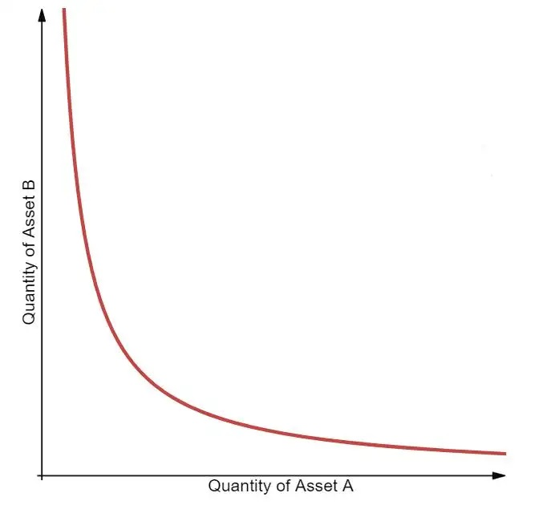
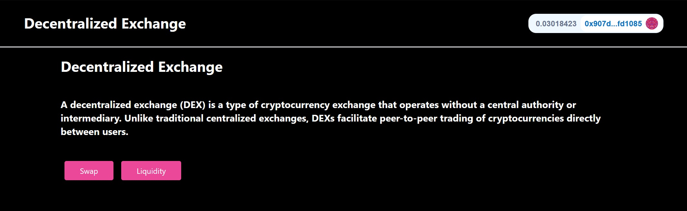
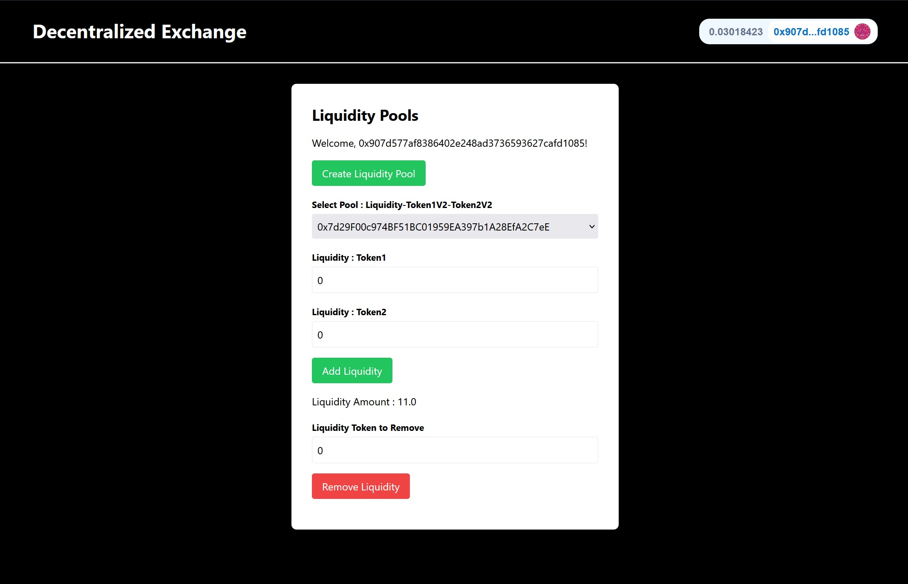
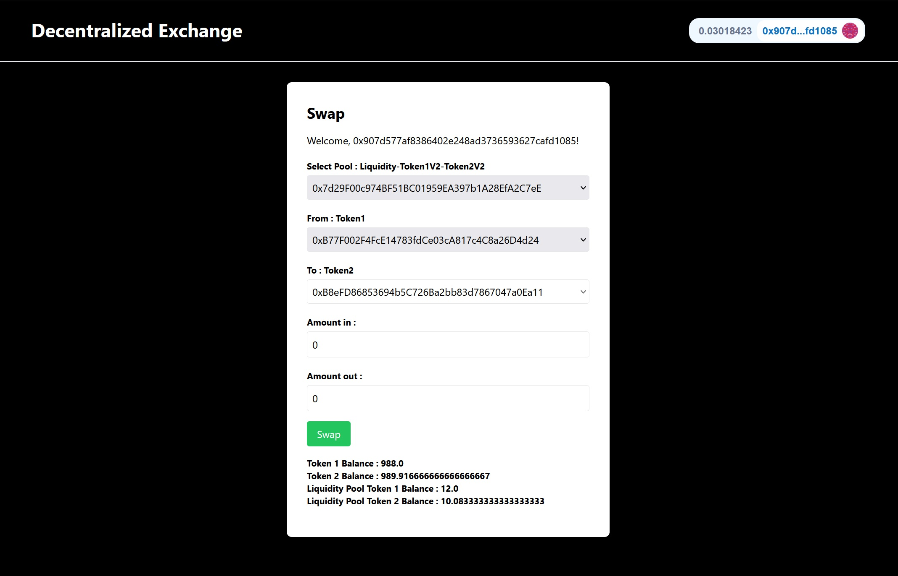

# Litepaper

## Project introduction

A DEX (decentralized exchange) is a peer-to-peer marketplace where users can trade cryptocurrencies in a non-custodial manner without the need for an intermediary to facilitate the transfer and custody of funds. DEXs substitute intermediaries—traditionally, banks, brokers, payment processors, or other institutions—with blockchain-based smart contracts that facilitate the exchange of assets. 

Compared to traditional financial transactions, which are opaque and run through intermediaries who offer extremely limited insight into their actions, DEXs offer complete transparency into the movement of funds and the mechanisms facilitating exchange. In addition, as user funds don’t pass through a third party’s cryptocurrency wallet during trading, DEXs reduce counterparty risk and can decrease systemic centralization risks in the cryptocurrency ecosystem.

Let's see what is the algorithm used to allow users to add liquidity and swap tokens from the pool.

## Constant k and Automated Market Makers (AMM)

xy=k is a simple formula where the product of two variables (x and y) is always constant (k). Visually, the formula creates the following curve:

Suppose x represents Token A and y represents Token B in a pool, and any point on the curve represents the exchange rate between Tokens A and B in that pool. The curve shows the different possible combinations of quantities that satisfy the xy=k equation. As the quantity of Token A increases, the quantity of Token B must decrease to keep the product (k) constant. More importantly, what this curve demonstrates is that there is always an exchange rate available for any given quantity of Token A or B.

The constant, represented by “k” means there is a constant balance of assets that determines the price of tokens in a liquidity pool. For example, if an AMM has a token1 and a token0, two volatile assets, every time token1 is bought, the price of token1 goes up as there is less token1 in the pool than before the purchase. Conversely, the price of token2 goes down as there is more token2 in the pool. The pool stays in constant balance, where the total value of token1 in the pool will always equal the total value of token2 in the pool. Only when new liquidity providers join in will the pool expand in size. Visually, the prices of tokens in an AMM pool follow a curve determined by the formula.

In this constant state of balance, buying one token1 brings the price of token1 up slightly along the curve, and selling one token1 brings the price of token1 down slightly along the curve. The opposite happens to the price of token2 in an token1-token2 pool. It doesn’t matter how volatile the price gets, there will eventually be a return to a state of balance that reflects a relatively accurate market price. If the AMM price ventures too far from market prices on other exchanges, the model incentivizes traders to take advantage of the price differences between the AMM and outside crypto exchanges until it is balanced once again.

The constant formula is a unique component of AMMs — it determines how the different AMMs function.

## User Interface

You can interact with the contract on the user interface by adding liquidity or swapping tokens.

##### Home Page

##### Pools page

##### Swap page

